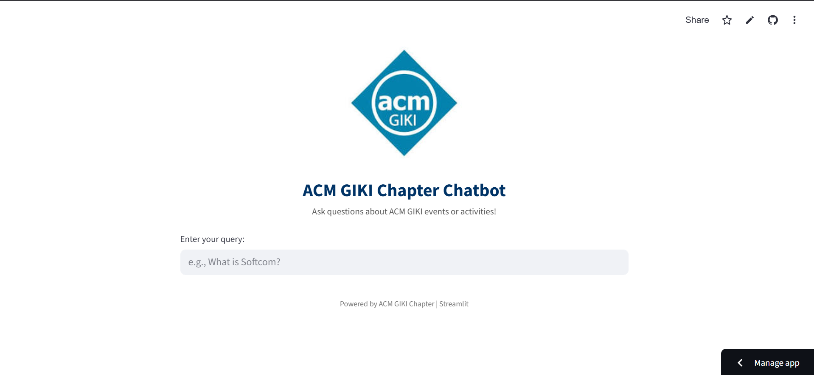

<h1 align="center">🤖 ACM GIKI Chapter Chatbot</h1>

  
  
  

  

<b>🚀 Ask intelligent questions about ACM GIKI events, competitions, and history – get instant AI-powered responses.</b>

---

## 📌 Project Overview

The **ACM GIKI Chapter Chatbot** is a Streamlit-based web app that intelligently answers user questions about the ACM GIKI Chapter using LangChain, FAISS vector store, and OpenAI GPT-3.5. It extracts answers from a detailed document about ACM activities, history, sponsors, and events like **Softcom**, **ICPC**, and more.

---

## 💡 Features

- ✅ Natural language Q&A over ACM GIKI's event data  
- ✅ Uses OpenAI embeddings + GPT-3.5  
- ✅ Styled interactive UI with Streamlit  
- ✅ Accurate responses via document chunking + similarity search  
- ✅ Lightweight, fast, and easy to deploy

---

## 🧠 Technologies Used

| Tool | Purpose |
|------|---------|
| [LangChain](https://www.langchain.com/) | Prompting, vector search chaining |
| [OpenAI GPT-3.5](https://openai.com) | LLM for natural language responses |
| [FAISS](https://github.com/facebookresearch/faiss) | Fast vector similarity search |
| [Streamlit](https://streamlit.io) | Web-based interactive UI |
| [OpenAI Embeddings](https://platform.openai.com/docs/guides/embeddings) | For turning chunks into vectors |

## 🧪 How It Works

1. 📄 **Input Data**: A long-form structured document on ACM GIKI.
2. ✂️ **Chunking**: Text is split using `RecursiveCharacterTextSplitter`.
3. 🔎 **Vectorization**: Embeddings created via OpenAI's `text-embedding-3-small`.
4. 📚 **Indexing**: FAISS builds an in-memory similarity search index.
5. 🤖 **Q&A Chain**: Top matching chunks are fed into a prompt + GPT-3.5 to generate final answers.
6. 💬 **UI Display**: Response is shown via a Streamlit input/output interface.

---

## 💻 Live Preview

